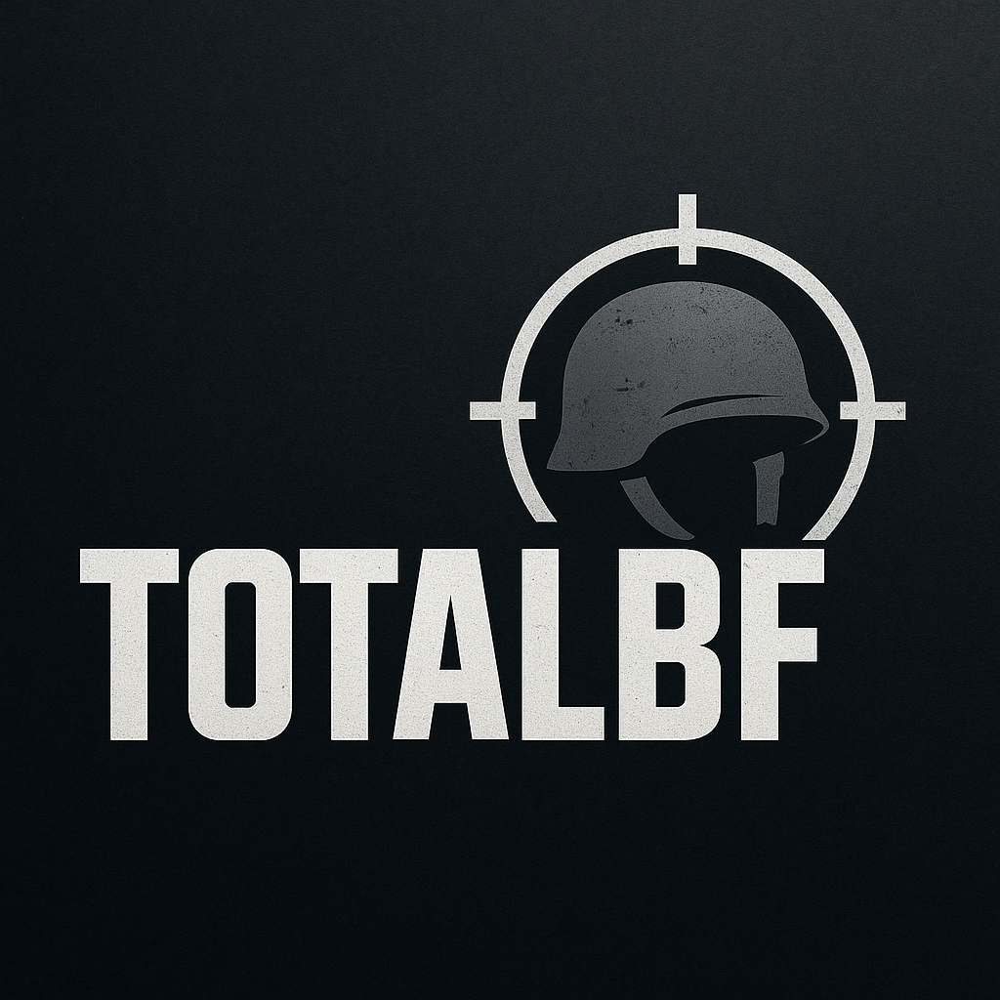

# TotalBF - Все про серію Battlefield

<div align="center">
  
</div>

TotalBF - це фан-сайт, присвячений серії ігор Battlefield від Electronic Arts та DICE. Наш сайт надає актуальну інформацію, новини, огляди та корисні матеріали для всіх шанувальників серії.

## 🚀 Технології

- **Frontend**: Next.js, React
- **CMS**: WordPress з GraphQL API
- **Інтернаціоналізація**: next-intl
- **Стилізація**: SCSS модулі
- **Деплой**: Netlify/Vercel

## 🌐 Особливості

- Статичний рендеринг сторінок для швидкого завантаження
- Інтеграція з WordPress для управління контентом
- Адаптивний дизайн для всіх пристроїв
- SEO-оптимізація
- Оптимізовані відео та YouTube вбудовування
- Виправлені помилки гідратації React для відео елементів
- Покращена стилізація

> **Примітка:** На даний момент багатомовність (українська та англійська) не підтримується. Функціонал перекладів знаходиться в розробці.

## 🛠️ Розробка

### Вимоги

* [Node.js](https://nodejs.org/) (версія 14 або вище)
* [WordPress](https://wordpress.org/) з налаштованим API
* [WPGraphQL](https://www.wpgraphql.com/) плагін для WordPress
* Змінні середовища (див. нижче)
```
WORDPRESS_GRAPHQL_ENDPOINT="http://wordpressite.com/graphql"
```

In some cases, the above may not work.
Change it as follows:
```
WORDPRESS_GRAPHQL_ENDPOINT="http://yourhost.com/index.php?graphql
```

### Налаштування середовища

Цей проект використовує WPGraphQL для запитів до WordPress за допомогою GraphQL. Щоб зробити запит до відповідної кінцевої точки, нам потрібно встановити змінну середовища, щоб Next.js знав, звідки запитувати інформацію про сайт.

Створіть новий файл локально під назвою `.env.local` та додайте наступне:

```bash
WORDPRESS_GRAPHQL_ENDPOINT="[WPGraphQL Endpoint]"
```

Замініть вміст змінної на вашу кінцеву точку WPGraphQL. За замовчуванням вона має виглядати як `[Ваш хост]/graphql`.

*Примітка: змінні середовища також можна статично налаштувати в next.config.js*

#### Усі змінні середовища

| Назва                              | Обов'язкова | За замовчуванням | Опис                                              |
| ---------------------------------- | ----------- | ---------------- | ------------------------------------------------- |
| WORDPRESS_GRAPHQL_ENDPOINT         | Так         | -                | WordPress WPGraphQL ендпоінт (напр: host.com/graphl)|
| WORDPRESS_MENU_LOCATION_NAVIGATION | Ні          | PRIMARY          | Налаштовує розташування меню навігації в шапці    |
| WORDPRESS_PLUGIN_SEO               | Ні          | false            | Вмикає підтримку SEO плагіна (true, false)        |

Зверніть увагу, що деякі теми не мають розташування меню PRIMARY.

### Розробка

Щоб запустити проект локально, виконайте:

```bash
yarn dev
# або
npm run dev
```

Проект буде доступний за адресою [http://localhost:3000](http://localhost:3000)!

#### Зображення та CDN

Для статичного обслуговування зображень можна використовувати Jetpack Image Accelerator. Ця функція дозволяє автоматично обслуговувати та кешувати зображення через CDN wp.com. Ця функція доступна безкоштовно з базовою установкою Jetpack.

[Jetpack CDN](https://jetpack.com/features/design/content-delivery-network/)

### SEO оптимізація

Проект підтримує плагін Yoast SEO, включаючи більшість основних функцій, таких як налаштування метаданих та налаштування Open Graph для соціальних мереж.

#### Вимоги для SEO
* Плагін Yoast SEO в WordPress
* Плагін WPGraphQL SEO для інтеграції з GraphQL

Щоб увімкнути підтримку SEO, налаштуйте `WORDPRESS_PLUGIN_SEO` на `true` або в змінних середовища, або в файлі next.config.js.

### 🛠️ Налаштування проекту

#### Змінні середовища

Для налаштування проекту використовуються наступні змінні середовища:

* `WORDPRESS_GRAPHQL_ENDPOINT` - URL до GraphQL ендпойнту WordPress
* `WORDPRESS_PLUGIN_SEO` - Увімкнення підтримки SEO плагіна

#### Деплой проекту

Проект можна розгорнути на різних платформах, таких як Netlify або Vercel. Для цього необхідно налаштувати змінні середовища на відповідній платформі.
