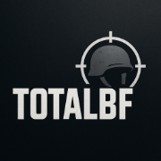

# TotalBF - Все про серію Battlefield



TotalBF - це фан-сайт, присвячений серії ігор Battlefield від Electronic Arts та DICE. Наш сайт надає актуальну інформацію, новини, огляди та корисні матеріали для всіх шанувальників серії.

## 🚀 Технології

- **Frontend**: Next.js, React
- **CMS**: WordPress з GraphQL API
- **Інтернаціоналізація**: next-intl
- **Стилізація**: SCSS модулі
- **Деплой**: Netlify/Vercel

## 🌐 Особливості

- Багатомовність (українська та англійська)
- Статичний рендеринг сторінок для швидкого завантаження
- Інтеграція з WordPress для управління контентом
- Адаптивний дизайн для всіх пристроїв
- SEO-оптимізація

## 🛠️ Розробка

### Вимоги

* [Node.js](https://nodejs.org/) (версія 14 або вище)
* [WordPress](https://wordpress.org/) з налаштованим API
* [WPGraphQL](https://www.wpgraphql.com/) плагін для WordPress
* Змінні середовища (див. нижче)
```
WORDPRESS_GRAPHQL_ENDPOINT="http://wordpressite.com/graphql"
```

In some cases, the above may not work.
Change it as follows:
```
WORDPRESS_GRAPHQL_ENDPOINT="http://yourhost.com/index.php?graphql
```

## 🚀 Getting Started

### What is this and what does it include?

The goal of this project is to take WordPress as a headless CMS and use Next.js to create a static experience without any 3rd party services that can be deployed anywhere.

The hope is to build out as many features as we can to support what's typically expected from an out of the box theme on WordPress. Currently, those features include:
* Blog (https://next-wordpress-starter.spacejelly.dev)
* Pages (https://next-wordpress-starter.spacejelly.dev/about/)
* Posts (https://next-wordpress-starter.spacejelly.dev/posts/how-to-create-a-headless-wordpress-blog-with-next-js-wordpress-starter/)
* Categories (https://next-wordpress-starter.spacejelly.dev/categories/tutorial/)
* Authors (https://next-wordpress-starter.spacejelly.dev/authors/colby-fayock/)
* Search (Client side global navigation and https://next-wordpress-starter.spacejelly.dev/search/?q=wordpress)
* RSS (https://next-wordpress-starter.spacejelly.dev/feed.xml)
* Sitemap (https://next-wordpress-starter.spacejelly.dev/sitemap.xml)

Additionally, the theme is expected to be SEO friendly and performant out of the box, including:
* Unique page titles
* Unique descriptions
* Open Graph tags

You can also optionally enable Yoast SEO plugin support to supercharge your SEO! (See below)

Check out the [Issues](https://github.com/colbyfayock/next-wordpress-starter/issues) for what's on deck!

*Want something a little more **basic**? Check out my other starter with an MVP setup to get up and running with WPGraphQL in WordPress: https://github.com/colbyfayock/next-wpgraphql-basic-starter*

### Requirements
* [WordPress](https://wordpress.org/)
* [WPGraphQL](https://www.wpgraphql.com/)
* Environment variables (see below)

### Environment

This project makes use of WPGraphQL to query WordPress with GraphQL. In order to make that request to the appropriate endpoint, we need to set a environment variable to let Next.js know where to request the site information from.

Create a new file locally called `.env.local` and add the following:

```bash
WORDPRESS_GRAPHQL_ENDPOINT="[WPGraphQL Endpoint]"
```

Replace the contents of the variable with your WPGraphQL endpoint. By default, it should resemble `[Your Host]/graphql`.

*Note: environment variables can optionally be statically configured in next.config.js*

#### All Environment Variables

| Name                               | Required | Default | Description                                       |
| ---------------------------------- | -------- | -       | ------------------------------------------------- |
| WORDPRESS_GRAPHQL_ENDPOINT         | Yes      | -       | WordPress WPGraphQL endpoint (ex: host.com/graphl)|
| WORDPRESS_MENU_LOCATION_NAVIGATION | No       | PRIMARY | Configures header navigation Menu Location        |
| WORDPRESS_PLUGIN_SEO               | No       | false   | Enables SEO plugin support (true, false)          |

Please note some themes do not have PRIMARY menu location.

### Development

To start the project locally, run:

```bash
yarn dev
# or
npm run dev
```

Проект буде доступний за адресою [http://localhost:3000](http://localhost:3000)!

### 🌐 Інтернаціоналізація

Проект підтримує багатомовність за допомогою бібліотеки next-intl. Переклади знаходяться в директорії `src/messages/` та розділені за мовами (українська - `uk`, англійська - `en`).

Основні файли перекладів:

- `header.json` - переклади для шапки сайту
- `footer.json` - переклади для підвалу сайту
- `news.json` - переклади для новин
- `dateTime.json` - переклади для форматування дати та часу
- `home.json` - переклади для головної сторінки

Конфігурація інтернаціоналізації знаходиться в файлі `next-intl.config.js`.

### WordPress

This project aims to take advantage of as many built-in WordPress features by default like a typical WordPress theme. Those include:

| Name                       | Usage                                   |
| -------------------------- | --------------------------------------- |
| Site Language              | `lang` attribute on the `<html>` tag    |
| Site Title                 | Homepage header, page metadata          |

#### Зображення та CDN

Для статичного обслуговування зображень можна використовувати Jetpack Image Accelerator. Ця функція дозволяє автоматично обслуговувати та кешувати зображення через CDN wp.com. Ця функція доступна безкоштовно з базовою установкою Jetpack.

[Jetpack CDN](https://jetpack.com/features/design/content-delivery-network/)

### SEO оптимізація

Проект підтримує плагін Yoast SEO, включаючи більшість основних функцій, таких як налаштування метаданих та налаштування Open Graph для соціальних мереж.

#### Вимоги для SEO
* Плагін Yoast SEO в WordPress
* Плагін WPGraphQL SEO для інтеграції з GraphQL

Щоб увімкнути підтримку SEO, налаштуйте `WORDPRESS_PLUGIN_SEO` на `true` або в змінних середовища, або в файлі next.config.js.

### 🛠️ Налаштування проекту

#### Змінні середовища

Для налаштування проекту використовуються наступні змінні середовища:

* `WORDPRESS_GRAPHQL_ENDPOINT` - URL до GraphQL ендпойнту WordPress
* `WORDPRESS_PLUGIN_SEO` - Увімкнення підтримки SEO плагіна

#### Деплой проекту

Проект можна розгорнути на різних платформах, таких як Netlify або Vercel. Для цього необхідно налаштувати змінні середовища на відповідній платформі.